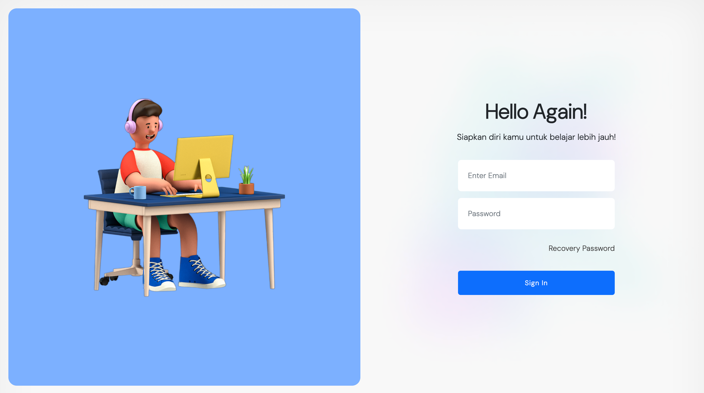

# E-Learning Management System (ELMS)




## Deskripsi Proyek

Proyek ini adalah implementasi E-Learning Management System yang terinspirasi dari Google Classroom. Sistem ini dirancang dengan fitur utama untuk memfasilitasi pengelolaan pembelajaran secara online. Terdapat tiga jenis pengguna utama, yaitu Admin, Guru, dan Siswa.

## Akun Pengguna

### Admin

-   Email: asd@gmail.com
-   Password: asd

### Guru

-   Email: guru@gmail.com
-   Password: 112233

### Siswa

-   Email: siswa@gmail.com
-   Password: 123123123

## Fitur Utama

### 1. User Privilege

-   Admin: memiliki hak akses penuh untuk mengelola seluruh sistem.
-   Guru: memiliki hak akses untuk membuat materi, tugas, dan ujian, serta menilai hasil tugas dan ujian siswa.
-   Siswa: memiliki hak akses untuk mengakses materi, mengerjakan tugas dan ujian, serta melihat penilaian yang diberikan oleh guru.

### 2. Manajemen Materi, Tugas, dan Ujian

-   **Materi:** Guru dapat membuat dan mengelola materi pembelajaran yang dapat diakses oleh siswa.
-   **Tugas:** Guru dapat memberikan tugas kepada siswa, dan siswa dapat mengumpulkan hasil tugas mereka melalui platform ini.
-   **Ujian:** Guru dapat membuat ujian online, dan siswa dapat mengerjakan ujian tersebut sesuai dengan jadwal yang ditentukan.

### 3. Penilaian Guru

-   Guru dapat memberikan penilaian terhadap hasil tugas dan ujian yang dikumpulkan oleh siswa.
-   Siswa dapat melihat penilaian mereka pada setiap tugas dan ujian.

## Tim Pengembang

-   **Adjie Surya Nugraha** - 118140146 (Product Owner)
-   **Yosia Gilbert Wuaten** - 118140174 (Full Stack Developer)
-   **Nestiawan Ferdiyanto** - 118140190 (Full Stack Developer)
-   **Rauli Sipakkar** - 120140001 (QA Engineer)

## Cara Menjalankan Proyek

1. Pastikan Anda memiliki lingkungan pengembangan PHP/Laravel yang sesuai (XAMPP dan Composer sudah terinstall).
2. Clone repositori ini ke dalam direktori lokal Anda (Folder htdocs).
    ```bash
    git clone https://github.com/aesencodes/elearning-sil.git
    ```
3. Install depedency

```bash
   composer install
```

4. Setup environtment variabel

```bash
   cp .env.example .env
```

```bash
   php artisan key:generate
```

5. Migrate dan Seed

```bash
   php artisan migrate:fresh --seed
```

6. Run local dev server

```bash
   php artisan serve
```
